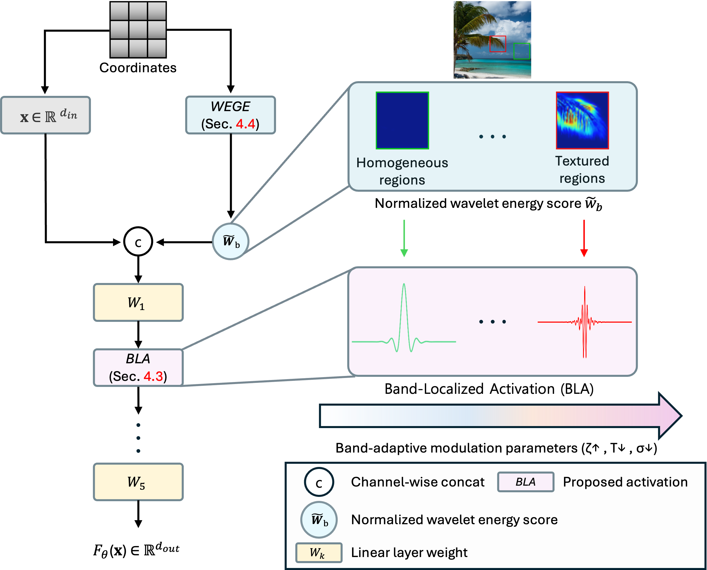

<div align="center">

  <h2>✨ FLAIR: Frequency- and Locality-Aware Implicit Neural Representations</h2>
  <h3 style="margin-top:-10px; font-weight:700;">
    [CVPR 2026 Findings]
  </h3>
  <div style="margin-top:6px;">
    <a href="https://scholar.google.com/citations?user=-VcWf7oAAAAJ&hl=ko" target="_blank">Sukhun Ko</a><sup>1</sup>&nbsp;
    <a href="https://scholar.google.com/citations?user=GTWolqAAAAAJ&hl=ko" target="_blank">Seokhyun Youn</a><sup>1</sup>&nbsp;
    <a href="https://scholar.google.com/citations?user=B9OneWIAAAAJ&hl=ko" target="_blank">Dahyeon Kye</a><sup>1</sup>&nbsp;
    <a href="https://sites.google.com/view/kylemin" target="_blank">Kyle Min</a><sup>2</sup>&nbsp;
    <a href="https://scholar.google.com/citations?user=3feNfdUAAAAJ&hl=ko&oi=sra" target="_blank">Chanho Eom</a><sup>1</sup>&nbsp;
    <a href="https://sites.google.com/view/ozbro" target="_blank">Jihyong Oh</a><sup>† 1</sup>
  </div>

  <div style="margin-top:4px;">
    <sup>1</sup>Chung-Ang University, South Korea<br>
    <sup>2</sup>Oracle, USA
  </div>

  <div style="margin-top:2px;">
    <sup>†</sup>Corresponding author
  </div>

</div>

---

<div align="center" style="margin-top:10px;">
  <a href="https://cmlab-korea.github.io/FLAIR/" target="_blank">
    
  </a>
  <a href="https://www.arxiv.org/pdf/2508.13544" target="_blank">
    
  </a>
  
</div>

---

<div align="center" style="margin-top:12px;">
  <h4>
    Official implementation of  
    <b>"FLAIR: Frequency- and Locality-Aware Implicit Neural Representations"</b>
  </h4>
</div>

<div align="center" style="margin-top:10px;">
    
    <p style="font-size:0.95em; max-width:850px;">
        <b>👀 Qualitative comparison.</b> FLAIR achieves faithful reconstruction while mitigating frequency leakage, 
        enabled by the band-limited behavior of BLA. Existing INR models show noise amplification and high-frequency distortion.
    </p>
</div>

---

## 📑 Table of Contents

- [📧 News](#-news)
- [✨ Abstract](#-abstract)
- [⚙️ Method Overview](#️-method-overview)
- [🔧 Dependencies and Installation](#-dependencies-and-installation)
- [🚀 Get Started](#-get-started)
  - [Data](#data)
    - [Data for 2D tasks](#data-for-2d-tasks)
    - [3D occupancy data](#3d-occupancy-data)
    - [Signed Distance Field (SDF) data](#signed-distance-field-sdf-data)
    - [NeRF data](#nerf-data)
  - [Tasks](#tasks)
  - [Options](#options)
    - [BLA Fast Mode](#bla-fast-mode)
    - [WEGE Module](#wege-module)
  - [Examples](#examples)
    - [SDF example](#sdf-example)
    - [NeRF example](#nerf-example)
    - [Batch fitting: VRAM-safe random sampling](#batch-fitting-vram-safe-random-sampling)
- [🙏 Acknowledgements](#-acknowledgements)
- [📜 License](#-license)
- [📝 Citation](#-citation)

---

## 📧 News

- **Feb 21, 2026:** FLAIR accepted to CVPR Findings 2026.
- **Dec 09, 2025:** Repository updated.

---

## ✨ Abstract

Implicit Neural Representations (INRs) encode signals by mapping coordinates to values using neural networks, enabling compact and continuous representations. While effective, existing INRs lack mechanisms for frequency selectivity and spatial localization, resulting in redundant feature learning and strong spectral bias, favoring low-frequency components while struggling to represent sharp details.

To address these limitations, we introduce **FLAIR**, a framework integrating two complementary innovations: (1) **Band-Localized Activation (BLA)**, a novel activation that enforces learnable band selection and spatial locality under the time-frequency uncertainty principle (TFUP). (2) **Wavelet-Energy-Guided Encoding (WEGE)**, which leverages discrete wavelet energy to guide frequency signals into the network.

FLAIR consistently improves reconstruction fidelity across 2D image representation, 3D shape modeling, and novel-view synthesis.

---

## ⚙️ Method Overview

<div align="center">
    
</div>

**WEGE:** Computes normalized wavelet-energy scores (w&#771;<sub>b</sub>). Smooth or homogeneous regions receive lower scores (green), while highly textured or high-frequency regions receive higher scores (red), enabling spatially aware frequency modulation.

**BLA:** The wavelet-energy scores are channel-wise concatenated with the input coordinates and processed using learnable, band-adaptive parameters (&zeta;, T, &sigma;). These parameters regulate frequency shifting and apply selective band-limiting across low- and high-frequency components.

---

## 🔧 Dependencies and Installation

1. Clone the repository.

    ```bash
    git clone https://github.com/CMLab-Korea/CVPRF26-FLAIR.git FLAIR
    cd FLAIR
    ```

2. Create the environment and install dependencies.

    ```bash
    conda create -n flair python=3.10 -y
    conda activate flair
    pip install --index-url https://download.pytorch.org/whl/cu128 torch torchvision
    pip install -r requirements.txt
    ```

    Tested on NVIDIA B200 with CUDA 12.8. For other GPUs, replace the `cu128` wheel index with the matching one from <https://pytorch.org/get-started/locally/>.

---

## 🚀 Get Started

### Data

Place datasets under `folder/data/`. The default arguments in the task scripts assume this layout.

#### Data for 2D tasks

##### Image data: Kodak + DIV2K subset (~22 MB)

```bash
wget https://github.com/<user>/<repo>/releases/download/v1.0/flair_dataset.zip
unzip flair_dataset.zip -d folder/data/
```

Expected layout:

```text
folder/data/kodak/   # 24 images
folder/data/div2k/   # 16 images
```

Original sources: [Kodak](https://r0k.us/graphics/kodak/) and [DIV2K](https://data.vision.ee.ethz.ch/cvl/DIV2K/).

##### CT reconstruction data

For `tasks/ct.py`, download `chest.png` and place it at:

```text
folder/data/chest.png
```

Download link: [Dropbox](https://www.dropbox.com/scl/fo/s1q0a8uwvz0guii1lvglv/ADYHh-Og_p52DN08MJ3QUg8?rlkey=sceq8f7bys28yimdmeaki2gsu&dl=0)

#### 3D occupancy data

For `tasks/occupancy.py`, download a `.mat` volume and place it at:

```text
folder/data/<expname>.mat
```

Download link: [Dropbox](https://www.dropbox.com/scl/fo/s1q0a8uwvz0guii1lvglv/ADYHh-Og_p52DN08MJ3QUg8?rlkey=sceq8f7bys28yimdmeaki2gsu&dl=0)

We thank the authors of [WIRE](https://github.com/vishwa91/wire) for providing the occupancy volume data.

#### Signed Distance Field (SDF) data

For `tasks/sdf/`, download the training point clouds and evaluation meshes:

```bash
cd tasks/sdf
python download_datasets.py          # downloads training point clouds (.xyz)
python download_datasets.py --eval   # downloads evaluation meshes (.ply) for Chamfer / IoU
```

Source: [Stanford 3D Scanning Repository](https://graphics.stanford.edu/data/3Dscanrep/).

#### NeRF data

For `tasks/nerf/`, download the standard Blender NeRF dataset and unzip it under:

```text
tasks/nerf/data/
```

Dataset link: [NeRF Synthetic Dataset](https://www.kaggle.com/datasets/nguyenhung1903/nerf-synthetic-dataset)

---

### Tasks

Every task runs as:

```bash
python tasks/<task>.py --image_path <path> [flags]
```

All models share a unified CLI. The default and recommended setting is `--nonlin bla`.

Available nonlinearities include:

```text
# BLA (ours)
--nonlin bla         # default, complex-valued (cfloat)
--nonlin bla_float   # real-valued, torch.compile-compatible

# Baselines
--nonlin siren
--nonlin wire
--nonlin gauss
--nonlin finer
```

| Task | Script | Example |
|---|---|---|
| Image fitting | `tasks/fitting.py` | `python tasks/fitting.py --image_path ./folder/data/div2k/00.png` |
| Super-resolution | `tasks/sr.py` | `python tasks/sr.py --image_path ./folder/data/div2k/00.png --scale 4` |
| CT reconstruction | `tasks/ct.py` | `python tasks/ct.py --image_path ./folder/data/chest.png` |
| 3D occupancy | `tasks/occupancy.py` | `python tasks/occupancy.py --expname thai_statue` |
| SDF fitting | `tasks/sdf/train_sdf.py` | `cd tasks/sdf && python train_sdf.py --model_type bla --config ./configs/bla_lucy.ini` |
| NeRF | `tasks/nerf/main_nerf.py` | `cd tasks/nerf && python main_nerf.py --nn bla --path ./data/nerf_synthetic/lego --lr 1e-3 --iters 37500 --downscale 4 --trainskip 4 --cuda_ray --preload --bound 1 --scale 0.8` |

---

### Options

#### BLA Fast Mode

Add `--fast` to any 2D task. This:

- switches the nonlinearity from `bla` (cfloat) to `bla_float` (real-valued), because `torch.compile`'s Inductor backend cannot lower complex tensors.
- applies `torch.compile(model)`, which lets TorchDynamo capture the forward graph and Inductor fuse the many small ops in an INR into Triton kernels, cutting kernel-launch overhead.

```bash
python tasks/fitting.py --image_path  --fast
```

This mode runs roughly 5× faster, with a small quality trade-off relative to the default BLA setting.

#### WEGE Module

Add `--use_wege` to any 2D task, including fitting, super-resolution, and CT reconstruction. This enables Wavelet-Energy-Guided Encoding (WEGE), which leverages wavelet-energy scores to guide frequency information to the network for adaptive frequency-aware representation. WEGE currently supports 2D tasks, while its extension to 3D representations, such as Gaussian splatting, is under active research and will be released soon. It is disabled by default.

```bash
python tasks/fitting.py --image_path  --use_wege
```

---

### Examples

#### SDF example

```bash
cd tasks/sdf

# 1) data: Stanford .ply + aligned xyz (one shot)
python download_datasets.py --eval

# 2) train (pick one)
#    quality (cfloat bla, default):
python train_sdf.py --model_type bla --config ./configs/bla_dragon.ini \
    --experiment_name dragon_bla --hidden_layers 3 --hidden_size 256

#    fast (bla_float + torch.compile, ~22% faster, IoU −0.7%p):
python train_sdf.py --model_type bla --config ./configs/bla_dragon.ini \
    --experiment_name dragon_bla_fast --hidden_layers 3 --hidden_size 256 --fast

# 3) extract mesh + evaluate (chamfer + IoU vs Stanford .ply)
python render_sdf.py --ckpt ../logs/dragon_bla/checkpoints/model_final.pth \
    --name dragon_bla --hidden_layers 3 --hidden_size 256

python eval.py --pred outputs/meshes/dragon_bla_1.obj --scene dragon
```

#### NeRF example

```bash
cd tasks/nerf

python main_nerf.py --nn bla --path ./data/nerf_synthetic/lego \
    --lr 1e-3 --iters 37500 \
    --downscale 4 --trainskip 4 \
    --cuda_ray --preload --bound 1 --scale 0.8 \
    --workspace logs/lego_bla
```

Defaults (`--num_layers 4 --hidden_dim 256 --dt_gamma 0.1`) are tuned for `--nn bla`.

#### Batch fitting: VRAM-safe random sampling

```bash
python tasks/batch_fitting.py \
    --image_path ./folder/data/tokyo.png \
    --niters 5000 --num_samples 262144 \
    --metric_every 2000 --eval_chunk 65536
```

Same fitting objective as `tasks/fitting.py`, but instead of forwarding all H·W pixels every iteration, it (a) samples K = `--num_samples` (default 262144) coords uniformly at random per step, and (b) runs chunked full-image eval every `--metric_every` iterations through `--eval_chunk`-sized forwards. Use this variant whenever `fitting.py` OOMs, e.g., the Tokyo gigapixel image. Add `--use_wege` to inject the WEGE wb map as the 3rd input channel (off by default, same convention as the other 2D tasks).

---

## 🙏 Acknowledgements

This codebase is based on [WIRE](https://github.com/vishwa91/wire), and the visualization code builds upon [FR-INR](https://github.com/CVL-UESTC/FR-INR). We thank the authors for making their code publicly available.

---

## 📜 License

The source codes including the checkpoint can be freely used for research and education only. Any commercial use should get formal permission from the principal investigator, Prof. Jihyong Oh, jihyongoh@cau.ac.kr.

---

## 📝 Citation

If you find our work useful for your research, please consider citing:

```bibtex
@inproceedings{ko2026flair,
  title     = {FLAIR: Frequency- and Locality-Aware Implicit Neural Representations},
  author    = {Ko, Sukhun and Youn, Seokhyun and Kye, Dahyeon and Min, Kyle and Eom, Chanho and Oh, Jihyong},
  booktitle = {Proceedings of the IEEE/CVF Conference on Computer Vision and Pattern Recognition Findings},
  year      = {2026},
  note      = {To appear}
}
```
